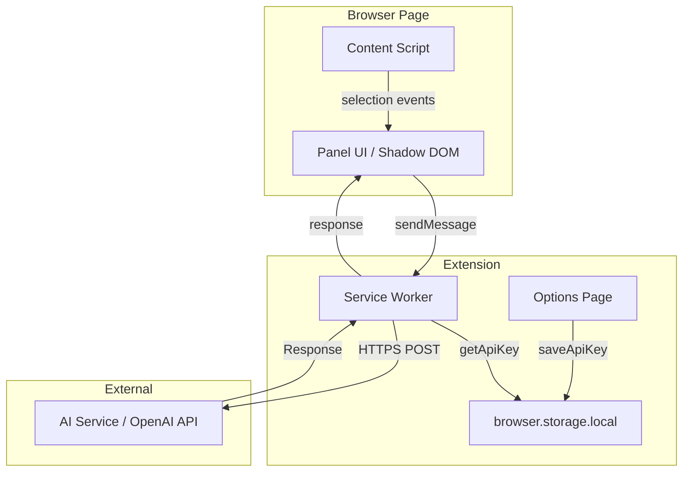

# Технический дизайн: Context AI Assistant

## Обзор

Context AI Assistant — браузерное расширение (MVP), которое встраивает AI-ассистента прямо в рабочий процесс пользователя. Пользователь выделяет текст на любой веб-странице, нажимает на появившуюся иконку и получает AI-ответ в компактной панели без переключения контекста.

Расширение реализуется как Manifest V3 Chrome Extension. Взаимодействие с AI происходит через OpenAI-совместимый API. API-ключ хранится в `browser.storage.local`.

### Ключевые технические решения

- **Manifest V3** — современный стандарт Chrome Extensions с Service Worker вместо Background Page
- **Content Script** — инжектируется на каждую страницу, отслеживает выделение и управляет UI
- **Shadow DOM** — изолирует стили панели от стилей хост-страницы
- **Service Worker (Background)** — проксирует запросы к AI_Service, хранит API-ключ
- **OpenAI Chat Completions API** — `gpt-4o-mini` как модель по умолчанию для баланса скорости и качества

---

## Архитектура



### Поток данных

1. Content Script слушает событие `mouseup` / `selectionchange`
2. При валидном выделении — рендерит `Trigger_Icon` рядом с выделением
3. Клик по иконке — открывает `Panel` (Shadow DOM)
4. Пользователь выбирает Action или вводит Query
5. Panel отправляет сообщение в Service Worker через `chrome.runtime.sendMessage`
6. Service Worker читает API-ключ из `storage.local`, формирует запрос к AI API
7. Ответ возвращается в Panel, отображается пользователю

---

## Компоненты и интерфейсы

### Content Script (`content.ts`)

Отвечает за:
- Отслеживание выделения текста
- Рендеринг и позиционирование `Trigger_Icon`
- Монтирование/размонтирование `Panel` в Shadow DOM

```typescript
interface SelectionState {
  text: string;           // выделенный текст
  rect: DOMRect;          // координаты выделения для позиционирования иконки
}

function getSelection(): SelectionState | null
function showTriggerIcon(rect: DOMRect): void
function hideTriggerIcon(): void
function openPanel(selection: SelectionState): void
function closePanel(): void
```

### Panel Component (`panel.ts`)

Отвечает за:
- Отображение цитаты выделенного текста
- Кнопки предустановленных Action
- Поле ввода Query
- Отображение Response / индикатора загрузки / ошибок
- Историю диалога (до 5 пар)
- Кнопку «Копировать»

```typescript
interface Message {
  role: 'user' | 'assistant';
  content: string;
}

interface PanelState {
  selection: string;
  messages: Message[];       // история диалога
  isLoading: boolean;
  error: string | null;
}

type Action = 'explain' | 'summarize' | 'elaborate';

function sendAction(action: Action): void
function sendQuery(query: string): void
function copyResponse(): void
```

### Service Worker (`background.ts`)

Отвечает за:
- Приём сообщений от Content Script
- Чтение API-ключа из `storage.local`
- Формирование и отправку запросов к AI API
- Возврат ответа или ошибки

```typescript
interface AIRequest {
  selection: string;
  messages: Message[];   // история для контекста
  action?: Action;
  query?: string;
}

interface AIResponse {
  ok: true;
  content: string;
}

interface AIError {
  ok: false;
  message: string;
}

async function handleAIRequest(req: AIRequest): Promise<AIResponse | AIError>
async function getApiKey(): Promise<string | null>
```

### Options Page (`options.ts`)

Отвечает за:
- Форму ввода API-ключа
- Сохранение/удаление ключа в `storage.local`

```typescript
async function saveApiKey(key: string): Promise<void>
async function clearApiKey(): Promise<void>
async function loadApiKey(): Promise<string | null>
```

### Messaging Protocol

Сообщения между Content Script и Service Worker:

```typescript
// Content Script → Service Worker
interface RequestMessage {
  type: 'AI_REQUEST';
  payload: AIRequest;
}

// Service Worker → Content Script
interface ResponseMessage {
  type: 'AI_RESPONSE';
  payload: AIResponse | AIError;
}
```

---

## Модели данных

### Хранилище (`browser.storage.local`)

```typescript
interface StorageSchema {
  apiKey?: string;   // API-ключ, хранится в storage.local (зашифровано браузером)
}
```

### Промпты для предустановленных действий

```typescript
const SYSTEM_PROMPTS: Record<Action, string> = {
  explain:   'Объясни следующий текст простыми словами:',
  summarize: 'Кратко изложи суть следующего текста:',
  elaborate: 'Дай развёрнутый анализ следующего текста:',
};
```

### Структура запроса к OpenAI Chat Completions API

```typescript
interface OpenAIChatRequest {
  model: string;                  // 'gpt-4o-mini'
  messages: OpenAIMessage[];
  max_tokens?: number;
  temperature?: number;
}

interface OpenAIMessage {
  role: 'system' | 'user' | 'assistant';
  content: string;
}
```

Формирование `messages` для запроса:
1. `system`: инструкция действия (для Action) или общий контекст (для Query)
2. `user`: выделенный текст (Selection) — первое сообщение
3. Далее — история диалога (до 5 пар `user`/`assistant`)
4. `user`: текущий Query (если есть)

### Ограничения

| Параметр | Значение |
|---|---|
| Макс. длина Selection | 10 000 символов |
| Макс. длина цитаты в Panel | 300 символов |
| Макс. глубина диалога | 5 пар вопрос/ответ |
| Таймаут запроса к AI | 15 секунд |
| Задержка показа иконки | ≤ 300 мс |
| Задержка открытия Panel | ≤ 200 мс |
| Задержка отображения Response | ≤ 200 мс после получения |


---

## Корректность (Correctness Properties)

*Свойство — это характеристика или поведение, которое должно выполняться при всех допустимых выполнениях системы. Свойства служат мостом между читаемыми человеком спецификациями и машинно-верифицируемыми гарантиями корректности.*

### Property 1: Показ иконки при валидном выделении

*Для любой* строки длиной ≥ 1 символа и ≤ 10 000 символов, функция определения видимости иконки должна возвращать `true`.

**Validates: Requirements 1.1**

---

### Property 2: Скрытие иконки при снятии выделения

*Для любого* состояния, в котором иконка отображается, после события снятия выделения иконка должна быть скрыта.

**Validates: Requirements 1.2**

---

### Property 3: Усечение цитаты в панели

*Для любой* строки Selection: если её длина ≤ 300 символов — цитата отображается без изменений; если длина > 300 символов — цитата усекается до 300 символов и заканчивается многоточием «…».

**Validates: Requirements 2.2**

---

### Property 4: Закрытие панели при dismiss-событии

*Для любого* состояния открытой панели, при получении события Escape или клика за пределами панели, панель должна перейти в состояние «закрыта».

**Validates: Requirements 2.5, 2.6**

---

### Property 5: Формирование запроса для предустановленного действия

*Для любого* действия (explain / summarize / elaborate) и любого текста Selection, функция `buildRequest` должна возвращать объект, в котором системное сообщение содержит инструкцию, соответствующую действию, а пользовательское сообщение содержит полный текст Selection.

**Validates: Requirements 3.1, 3.2, 3.3**

---

### Property 6: Состояние загрузки блокирует повторную отправку

*Для любого* состояния панели с `isLoading = true`, кнопка отправки должна быть заблокирована и индикатор загрузки должен быть виден.

**Validates: Requirements 3.4, 4.3**

---

### Property 7: Запрос с произвольным Query содержит Selection и Query

*Для любого* непустого Query и любого Selection, функция `buildRequest` должна возвращать объект, содержащий и Selection, и Query в сообщениях запроса.

**Validates: Requirements 4.1**

---

### Property 8: Обработка ошибки AI_Service

*Для любого* ответа AI_Service с ошибкой (или таймаута), панель должна отображать сообщение об ошибке и кнопку «Повторить».

**Validates: Requirements 5.1, 5.2**

---

### Property 9: Повтор запроса идентичен оригиналу

*Для любого* последнего запроса, сохранённого в состоянии панели, нажатие «Повторить» должно отправить запрос с теми же параметрами (selection, action/query, история).

**Validates: Requirements 5.3**

---

### Property 10: Round-trip копирования ответа

*Для любого* текста Response, после нажатия кнопки «Копировать» содержимое буфера обмена должно быть идентично полному тексту Response.

**Validates: Requirements 6.1, 6.2**

---

### Property 11: Round-trip сохранения API-ключа

*Для любого* непустого API-ключа, после сохранения через `saveApiKey` последующий вызов `getApiKey` должен вернуть тот же ключ.

**Validates: Requirements 7.2**

---

### Property 12: API-ключ передаётся только в заголовке запроса

*Для любого* сформированного HTTP-запроса к AI_Service, API-ключ должен присутствовать в заголовке `Authorization` и отсутствовать в теле запроса и URL.

**Validates: Requirements 7.3**

---

### Property 13: Контекст диалога включает историю

*Для любой* истории диалога из N пар (N ≥ 1), при отправке нового Query функция `buildRequest` должна включать все предыдущие сообщения в массив `messages`.

**Validates: Requirements 8.2**

---

### Property 14: Инвариант глубины диалога

*Для любого* количества отправленных сообщений, длина истории диалога в состоянии панели не должна превышать 5 пар «вопрос — ответ».

**Validates: Requirements 8.3**

---

## Обработка ошибок

| Ситуация | Поведение |
|---|---|
| Selection > 10 000 символов | Иконка не показывается; в Panel — сообщение об ошибке |
| Пустой Query при отправке | Запрос не отправляется; подсказка «Введите вопрос» |
| API-ключ не настроен | Запрос не отправляется; сообщение «Добавьте API-ключ в настройках расширения» |
| AI_Service вернул ошибку | Сообщение «Не удалось получить ответ. Попробуйте ещё раз» + кнопка «Повторить» |
| Таймаут 15 секунд | Аналогично ошибке AI_Service |
| Ошибка копирования в буфер | Кнопка остаётся в исходном состоянии; подтверждение не показывается |

### Стратегия обработки ошибок

- Все ошибки перехватываются в Service Worker и возвращаются как `AIError` с полем `message`
- Content Script / Panel не делает прямых запросов к AI — только через Service Worker
- Таймаут реализуется через `AbortController` с `setTimeout` на 15 000 мс
- Состояние ошибки хранится в `PanelState.error` и сбрасывается при новом запросе

---

## Стратегия тестирования

### Подход

Используется двойная стратегия: **unit-тесты** для конкретных примеров и граничных случаев + **property-based тесты** для универсальных свойств.

### Инструменты

- **Unit / Property тесты**: [fast-check](https://github.com/dubzzz/fast-check) (TypeScript) + Vitest
- **E2E**: Playwright с расширением Chrome (опционально для MVP)

### Unit-тесты (конкретные примеры и edge-cases)

- Рендеринг панели содержит три кнопки Action (Req 2.3)
- Рендеринг панели содержит поле ввода Query (Req 2.4)
- Страница настроек содержит поле API-ключа (Req 7.1)
- Selection = 10 000 символов — иконка показывается (граница)
- Selection = 10 001 символов — иконка не показывается (граница)
- Пустой Query — запрос не отправляется, показывается подсказка (Req 4.2)
- Отсутствие API-ключа — показывается нужное сообщение (Req 5.4)
- Удаление API-ключа: сохранить → очистить → проверить отсутствие (Req 7.4)

### Property-based тесты

Каждый property-тест запускается минимум **100 итераций** с генерацией случайных входных данных.

Формат тега: `Feature: context-ai-assistant, Property {N}: {краткое описание}`

| # | Свойство | Генераторы | Тег |
|---|---|---|---|
| 1 | Показ иконки при валидном выделении | `fc.string({ minLength: 1, maxLength: 10000 })` | `Property 1: valid selection shows icon` |
| 2 | Скрытие иконки при снятии выделения | `fc.boolean()` (состояние иконки) | `Property 2: deselect hides icon` |
| 3 | Усечение цитаты | `fc.string()` | `Property 3: quote truncation` |
| 4 | Закрытие панели при dismiss | `fc.constantFrom('escape', 'outside-click')` | `Property 4: panel dismiss` |
| 5 | Формирование запроса для Action | `fc.constantFrom('explain','summarize','elaborate')`, `fc.string({ minLength: 1 })` | `Property 5: action request building` |
| 6 | Состояние загрузки | `fc.boolean()` (isLoading) | `Property 6: loading state` |
| 7 | Query + Selection в запросе | `fc.string({ minLength: 1 })` × 2 | `Property 7: query request building` |
| 8 | Обработка ошибки AI | `fc.constantFrom('error', 'timeout')` | `Property 8: error handling` |
| 9 | Повтор запроса идентичен | `fc.record(...)` (AIRequest) | `Property 9: retry idempotence` |
| 10 | Round-trip копирования | `fc.string({ minLength: 1 })` | `Property 10: copy round-trip` |
| 11 | Round-trip API-ключа | `fc.string({ minLength: 1 })` | `Property 11: api key round-trip` |
| 12 | Ключ только в заголовке | `fc.string({ minLength: 1 })` | `Property 12: api key in header only` |
| 13 | Контекст диалога | `fc.array(fc.record(...), { minLength: 1, maxLength: 5 })` | `Property 13: dialog context` |
| 14 | Инвариант глубины диалога | `fc.integer({ min: 1, max: 20 })` (кол-во сообщений) | `Property 14: dialog depth invariant` |

### Покрытие

- Все 14 свойств покрываются property-based тестами
- Edge-cases (границы 10 000 символов, пустой Query, отсутствие ключа) покрываются unit-тестами
- UI-требования без автоматической проверки (1.4, 4.4) — ручное тестирование
