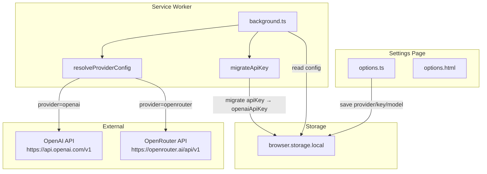

# Технический дизайн: OpenRouter Support

## Обзор

Фича добавляет поддержку OpenRouter как альтернативного AI-провайдера в браузерное расширение Context AI Assistant. OpenRouter совместим с форматом OpenAI Chat Completions API, отличается только base URL (`https://openrouter.ai/api/v1`) и двумя дополнительными заголовками (`HTTP-Referer`, `X-Title`).

Изменения затрагивают три слоя:
- **StorageSchema** — новые поля для хранения провайдера, ключей и моделей
- **Service Worker** — логика маршрутизации запросов и миграции устаревших данных
- **Settings Page** — UI для выбора провайдера, ввода ключа и модели

Существующие пользователи OpenAI не теряют настройки: при обнаружении устаревшего ключа `apiKey` выполняется автоматическая миграция.

---

## Архитектура



### Поток данных при запросе

1. Service Worker получает `AI_REQUEST` от Content Script
2. `migrateApiKey()` проверяет наличие устаревшего `apiKey` и при необходимости мигрирует его
3. `resolveProviderConfig()` читает `provider`, соответствующий ключ и модель из storage
4. Формируется HTTP-запрос к нужному endpoint с нужными заголовками
5. Ответ возвращается в Content Script

---

## Компоненты и интерфейсы

### Service Worker (`background.ts`)

Новые функции:

```typescript
// Возвращает конфигурацию активного провайдера
export async function resolveProviderConfig(): Promise<ProviderConfig>

// Мигрирует устаревший apiKey → openaiApiKey (идемпотентно)
export async function migrateApiKey(): Promise<void>

// Формирует заголовки запроса в зависимости от провайдера
export function buildHeaders(apiKey: string, provider: Provider): Record<string, string>
```

Изменения в `handleAIRequest`:
- Вызывает `migrateApiKey()` перед чтением конфига
- Использует `resolveProviderConfig()` вместо прямого чтения `apiKey`
- Передаёт `provider` в `buildHeaders()`

### Options Page (`options.ts` + `options.html`)

Новые функции:

```typescript
export async function saveProviderSettings(settings: ProviderSettings): Promise<void>
export async function loadProviderSettings(): Promise<ProviderSettings>
```

UI-изменения в `options.html`:
- `<select id="provider">` — выбор провайдера (OpenAI / OpenRouter)
- `<input id="api-key">` — поле ключа (уже есть, адаптируется)
- `<input id="model">` — поле модели с placeholder по умолчанию
- При смене провайдера форма обновляет placeholder и загружает сохранённые значения

---

## Модели данных

### Новые типы (`types.ts`)

```typescript
export type Provider = 'openai' | 'openrouter';

export interface ProviderConfig {
  provider: Provider;
  apiKey: string;
  model: string;
  baseUrl: string;
}

export interface ProviderSettings {
  provider: Provider;
  openaiApiKey?: string;
  openrouterApiKey?: string;
  openaiModel?: string;
  openrouterModel?: string;
}
```

### Обновлённая StorageSchema

```typescript
export interface StorageSchema {
  // Устаревшее поле (до обновления) — только для миграции
  apiKey?: string;

  // Новые поля
  provider?: Provider;           // 'openai' | 'openrouter', default: 'openai'
  openaiApiKey?: string;
  openrouterApiKey?: string;
  openaiModel?: string;          // default: 'gpt-4o-mini'
  openrouterModel?: string;      // default: 'openai/gpt-4o-mini'
}
```

### Константы провайдеров

```typescript
export const PROVIDER_DEFAULTS = {
  openai: {
    baseUrl: 'https://api.openai.com/v1/chat/completions',
    model: 'gpt-4o-mini',
  },
  openrouter: {
    baseUrl: 'https://openrouter.ai/api/v1/chat/completions',
    model: 'openai/gpt-4o-mini',
  },
} as const;

export const OPENROUTER_HEADERS = {
  'HTTP-Referer': chrome.runtime.id,   // идентификатор расширения
  'X-Title': 'Context AI Assistant',
} as const;
```

### Логика `resolveProviderConfig`

```
1. Прочитать provider из storage (default: 'openai')
2. Если provider = 'openai':
     apiKey = openaiApiKey
     model  = openaiModel ?? 'gpt-4o-mini'
     baseUrl = PROVIDER_DEFAULTS.openai.baseUrl
3. Если provider = 'openrouter':
     apiKey = openrouterApiKey
     model  = openrouterModel ?? 'openai/gpt-4o-mini'
     baseUrl = PROVIDER_DEFAULTS.openrouter.baseUrl
4. Если apiKey отсутствует → вернуть ошибку
```

### Логика `migrateApiKey` (идемпотентная)

```
1. Прочитать apiKey и openaiApiKey из storage
2. Если apiKey существует И openaiApiKey отсутствует:
     storage.set({ openaiApiKey: apiKey })
     storage.remove('apiKey')
3. Иначе: ничего не делать
```

---


## Корректность (Correctness Properties)

*Свойство — это характеристика или поведение, которое должно выполняться при всех допустимых выполнениях системы. Свойства служат мостом между читаемыми человеком спецификациями и машинно-верифицируемыми гарантиями корректности.*

### Property 1: Round-trip сохранения провайдера

*Для любого* значения Provider из `{'openai', 'openrouter'}`, после сохранения через `saveProviderSettings` последующий вызов `loadProviderSettings` должен вернуть тот же Provider. Если Provider не сохранён, `loadProviderSettings` должен вернуть `'openai'`.

**Validates: Requirements 1.2, 1.3**

---

### Property 2: API-ключ сохраняется под правильным storage-ключом

*Для любого* провайдера и любой непустой строки API-ключа, после сохранения ключ должен находиться в `browser.storage.local` под ключом `openaiApiKey` (для OpenAI) или `openrouterApiKey` (для OpenRouter), и не под ключом другого провайдера.

**Validates: Requirements 2.2, 2.3**

---

### Property 3: API-ключ передаётся только в заголовке Authorization

*Для любого* провайдера и любого API-ключа, в сформированном HTTP-запросе к AI_Service ключ должен присутствовать в заголовке `Authorization: Bearer <key>` и отсутствовать в теле запроса и URL.

**Validates: Requirements 2.6**

---

### Property 4: Round-trip сохранения модели

*Для любого* провайдера и любой строки модели, после сохранения через `saveProviderSettings` последующий вызов `loadProviderSettings` должен вернуть ту же строку модели для этого провайдера. Если модель не сохранена, должно возвращаться значение по умолчанию (`gpt-4o-mini` для OpenAI, `openai/gpt-4o-mini` для OpenRouter).

**Validates: Requirements 3.2, 3.3, 3.4, 3.5**

---

### Property 5: Маршрутизация запроса к правильному endpoint

*Для любого* провайдера, API-ключа и модели, функция `resolveProviderConfig` должна возвращать конфигурацию с `baseUrl = 'https://api.openai.com/v1/chat/completions'` для OpenAI и `baseUrl = 'https://openrouter.ai/api/v1/chat/completions'` для OpenRouter, а также соответствующий ключ и модель.

**Validates: Requirements 4.2, 4.3**

---

### Property 6: Тело запроса одинаково для обоих провайдеров

*Для любого* `AIRequest` и любого провайдера, функция `buildMessages` должна возвращать одинаковый массив сообщений в формате OpenAI Chat Completions API независимо от выбранного провайдера.

**Validates: Requirements 4.4**

---

### Property 7: Заголовки OpenRouter присутствуют только для OpenRouter

*Для любого* API-ключа, функция `buildHeaders` должна:
- при `provider = 'openrouter'` — включать заголовки `HTTP-Referer` и `X-Title: Context AI Assistant`
- при `provider = 'openai'` — не включать заголовки `HTTP-Referer` и `X-Title`

**Validates: Requirements 5.1, 5.2, 5.3**

---

### Property 8: Миграция устаревшего apiKey

*Для любого* непустого значения устаревшего `apiKey` при отсутствии `openaiApiKey`, после вызова `migrateApiKey` в `browser.storage.local` должен присутствовать `openaiApiKey` с тем же значением и отсутствовать ключ `apiKey`. Повторный вызов `migrateApiKey` не должен изменять состояние storage (идемпотентность).

**Validates: Requirements 6.1, 6.2**

---

## Обработка ошибок

| Ситуация | Поведение |
|---|---|
| API-ключ для выбранного провайдера отсутствует | `handleAIRequest` возвращает `AIError`: «Добавьте API-ключ в настройках расширения» |
| Provider не сохранён в storage | `resolveProviderConfig` использует `'openai'` по умолчанию |
| Модель не сохранена в storage | `resolveProviderConfig` использует default-модель провайдера |
| Устаревший `apiKey` без `openaiApiKey` | `migrateApiKey` автоматически мигрирует ключ перед обработкой запроса |
| Ошибка HTTP от AI_Service | Возвращается `AIError`: «Не удалось получить ответ. Попробуйте ещё раз» (поведение не меняется) |
| Таймаут запроса | Аналогично ошибке HTTP (поведение не меняется) |

### Стратегия обработки ошибок

- `migrateApiKey` вызывается в начале `handleAIRequest` — до любого обращения к storage за ключом
- `resolveProviderConfig` возвращает `ProviderConfig | null`; при `null` `handleAIRequest` возвращает `AIError`
- Все ошибки конфигурации обрабатываются в Service Worker и не доходят до Content Script в виде исключений

---

## Стратегия тестирования

### Подход

Двойная стратегия: **unit-тесты** для конкретных примеров и граничных случаев + **property-based тесты** для универсальных свойств.

### Инструменты

- **Unit / Property тесты**: [fast-check](https://github.com/dubzzz/fast-check) + Vitest (уже используются в проекте)

### Unit-тесты (конкретные примеры и edge-cases)

- Settings Page содержит `<select>` с вариантами «OpenAI» и «OpenRouter» (Req 1.1)
- Settings Page содержит поле ввода API-ключа (Req 2.1)
- Settings Page содержит поле ввода модели (Req 3.1)
- Очистка API-ключа удаляет его из storage (Req 2.5)
- Отсутствие provider в storage → `resolveProviderConfig` возвращает конфиг OpenAI (Req 4.6, 6.3)
- Отсутствие API-ключа → `handleAIRequest` возвращает `AIError` с нужным сообщением (Req 4.5)
- `migrateApiKey` при уже мигрированных данных ничего не меняет (идемпотентность, Req 6.2)

### Property-based тесты

Каждый property-тест запускается минимум **100 итераций**.

Формат тега: `Feature: openrouter-support, Property {N}: {краткое описание}`

| # | Свойство | Генераторы | Тег |
|---|---|---|---|
| 1 | Round-trip провайдера | `fc.constantFrom('openai', 'openrouter')` | `Property 1: provider round-trip` |
| 2 | API-ключ под правильным storage-ключом | `fc.constantFrom('openai', 'openrouter')`, `fc.string({ minLength: 1 })` | `Property 2: api key storage key` |
| 3 | API-ключ только в заголовке Authorization | `fc.constantFrom('openai', 'openrouter')`, `fc.string({ minLength: 1 })` | `Property 3: api key in header only` |
| 4 | Round-trip модели + defaults | `fc.constantFrom('openai', 'openrouter')`, `fc.option(fc.string({ minLength: 1 }))` | `Property 4: model round-trip` |
| 5 | Маршрутизация к правильному endpoint | `fc.constantFrom('openai', 'openrouter')`, `fc.string({ minLength: 1 })` | `Property 5: provider routing` |
| 6 | Тело запроса одинаково для обоих провайдеров | `fc.record({ selection: fc.string(), messages: fc.array(...) })`, `fc.constantFrom('openai', 'openrouter')` | `Property 6: request body invariant` |
| 7 | Заголовки OpenRouter только для OpenRouter | `fc.constantFrom('openai', 'openrouter')`, `fc.string({ minLength: 1 })` | `Property 7: openrouter headers` |
| 8 | Миграция apiKey (round-trip + идемпотентность) | `fc.string({ minLength: 1 })` | `Property 8: api key migration` |
